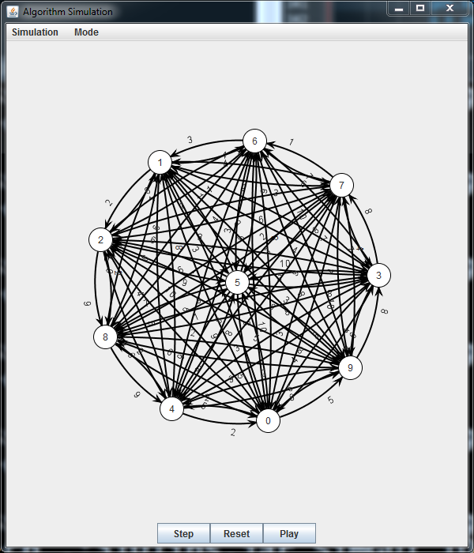

# dijkstra-s-algorithm-Visualizer
A interactive visual GUI using JUNG library to help visualize dijkstra's algorithm 

Added JAR library file 

for windows:
javac -cp .;310libs.jar *.java
java -cp .;310libs.jar SimGUI //arg1 == number of nodes && arg2 == connectivity (i.e .5 == 50% of nodes are connected)

for example (java -cp .:310libs.jar SimGUI 10 1)//will generate 10 nodes where all are connected

for Linux/MacOS
javac -cp .:310libs.jar *.java
java -cp .:310libs.jar SimGUI //arg1 == number of nodes && arg2 == connectivity (i.e .5 == 50% of nodes are connected)

EXAMPLES:

