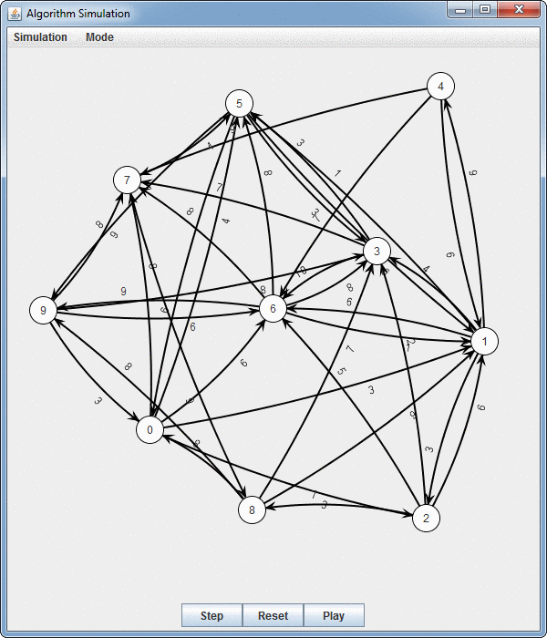

I implemented a interactive visual GUI using the JUNG library to help visualize dijkstra's algorithm

Added JAR library file

for windows:

javac -cp .;310libs.jar *.java

java -cp .;310libs.jar SimGUI

argument 1 is number of nodes
argument 2 is the connectivity (i.e .5 == 50% of nodes are connected)
for example: java -cp .:310libs.jar SimGUI 10 1 (will generate 10 nodes where all nodes are connected)

for Linux/MacOS

javac -cp .:310libs.jar *.java

java -cp .:310libs.jar SimGUI

argument 1 is number of nodes
argument 2 is the connectivity (i.e .5 == 50% of nodes are connected)

EXAMPLES:

